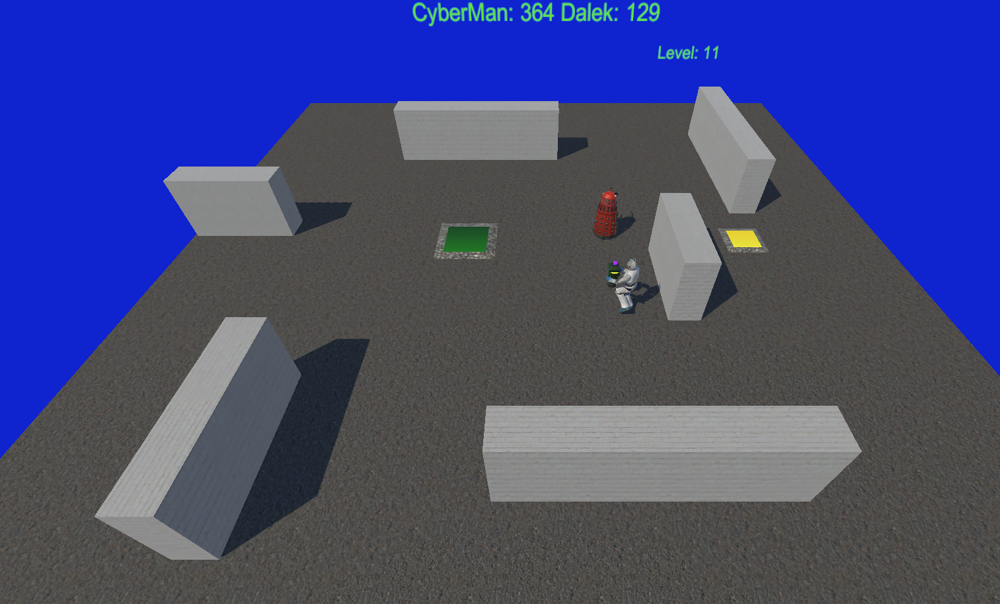
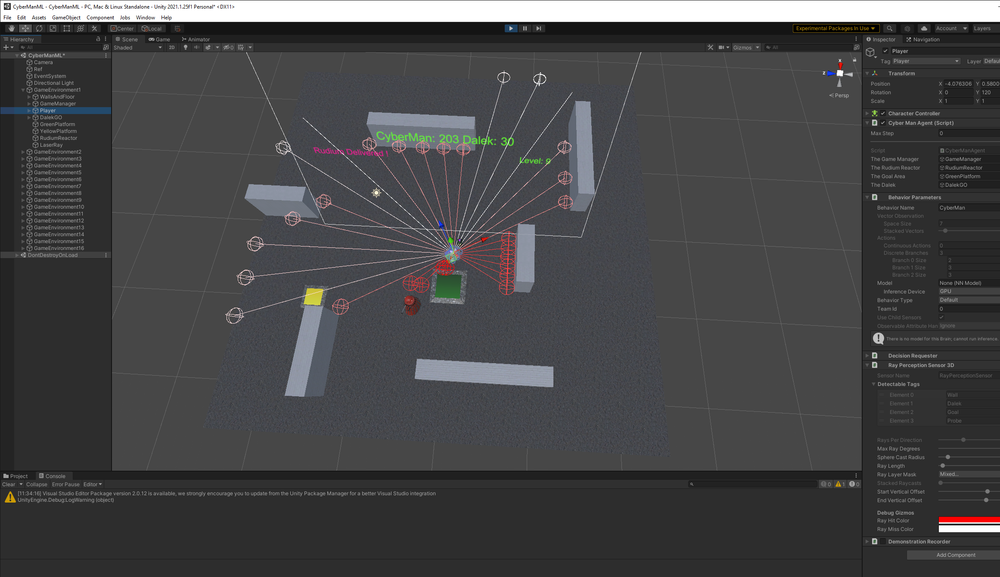
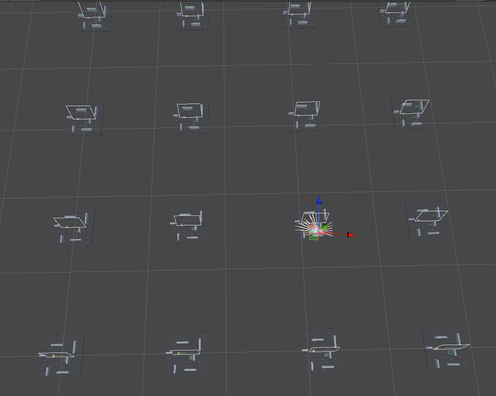
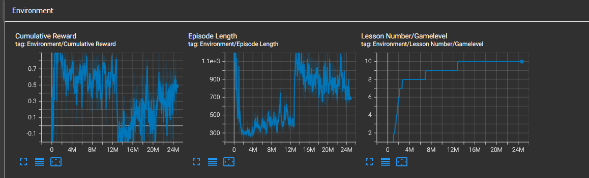

# Unity ML Agent: Cyberman vs Dalek

A review of Unity ML Agents in an attempt to train an Agent within a wall obscured environment. 

This has been inspired by the OpenAI Hide and Seek games. (https://www.vox.com/future-perfect/2019/9/20/20872672/ai-learn-play-hide-and-seek) 

Please see the results of the Trained Cyberman Agent, performing reasonably well at [You Tube]

The results are rather mixed, interesting but not really up to expectations.  

### Overview
The Cyberman has to Pick up the Rudium probe from the Yellow Platform, and Place it down at or near the Green reception Platform.  A Dalek is also in the arena, and will kill the Cyberman, if it is within its frontal line os sight.  The Cyberman and Dalek Line of sights are obscured by various walls within the Arena. 

### Setup
Actions: The Cyberman Actions are NOOP(Idle), Move Forward, Rotate Left, Rotate Right, Pickup and Place Down.  These are arranged as  single Branch Discret Action. 
Observations: The Cyberman is set up as an ML Agent, with Ray perception Sensors for the Dalek, Walls, Probe and Goal Area. The Cyberman also has boolean Indicators, of whetehr the Dalek can see him, Is he currently holding the Probe, and Can Can he Pickup The Probe.

[CHEAT] Note I could only get reasonable performance if I also included float observations: Relative bearing and Range to Dalek, Probe and Goal Area, regadles of whether they could see it. Albeit I am not sure if the nueral network actually took much notioce of these, as it seemed to be more reliant upon teh Ray perception Sensors. 

The Rewards are allocated +1.0f for successfully placing down the Probe, at or near the Goal Area. -1.0f if The Agent runs out of Max Episode steps (set at 10,000) or is killed by the Dalek.  There is a +0.2f Reward for the first Initial Picking up the Probe and a -0.2f Rewrd for any Placing down the Probe. This is to avoid excessive Pickups and Drop Downs.  There is a per step Reward penalty of -0.25f/Max Steps to encourage faster episdoe trajectories. Ths is increased to -0.5f/Max Steps penalty for NOOP/ Idle to encourage positive Agent play.   

The Dalek is a Unity NavMesh Agent. Which will either move towards a random position or twoards the Cyberman if it sees it within a 60 degree cone in front of him.  In early levels of the Training the Dalek has very slow speeds, will emerge from the North West or North East, and direct itself towards the centre of the Arena, unless it sees the Cyberman.

The game Arena, Cyberman Agent, Dalek and Game Objects are all captured within the GameEnvironment Unity Prefab.So any changes to the Agent should be done within this Prefab. This Prefab was then replicacted into 16x GameEnvironment Game Objects within the Training Scene, for 'faster' Training.  

### Training 
The Agent was trained through a Combination of GAIL and Curriculum Learning. 

The Curriculum Learning Levels advanced the difficulty. The intention being to enable the Agent to discover, and grow its experience and training gently through increasing levels of difficulty.  As the Agent discovers, and exploits its Trained objectives, and achieves consistent average rewards (0.825f), it is promoted to the next Curriculum Level
In the early Levels Agent is spawned to the South, and the Probe and Goal Areas are spawned in the Middle of the Arena. The Dalek remains stationary in the North Eats or North West Spawn Points, and presents no threat in the ealry levels.

- Level 1:  The first very Basic level, with Probe and Goal and Cyberman Agent spawned near the middle of the Arena. The Agent has to discover its core objective of picking up and palcing down the Probe in teh Goal area, before it can advance to level 2.  So this discovery phase has to be very simple and easy. 
- Levels 2 to 5:  As the Agent learns to achieve its Reward average, the random Spawn Points diverge further away from the centre of the Arena. The Dalek is given small, but increasing Speed, to show some presence. 
- Levels 6 to 10:  Further diversity in Spawn points, and the Dalek is given increased speed, and now imposes a signfiricant Threat.
- Levels 11+ : All the Probe, Goal, Cyberman Agent and Dalek Spawn Points are randomally distributed all around the Arena, sometimes behind Walls etc. (Sometimes the Dalek may Spawn directly next to the Agent)  Level 11, therfore represents a major shift in challenge.

The GAIL imitation is Trained against a Level 6 environment, where the Dalek is begining to impose itself as a threat. This demo is saved, and used to help orientate the Agents initial behaviour. The GAIl strength is set to 0.1

## Conclusions

See the You Tube Video of the performance after 25 Million Training Steps

The Agent Progressed through the first 8 Levels to reach level 9 within 3.5 Million Training Steps. The ganet failed to get beyond level 11. 

- The Agent discovered and exploited the main Objective of Picking and Placing down the Probe into the Green Area, within the first half Million Steps (Levels 1 to 3)

- The Agent discovers that the Dalek poses a Threat, and learns to take avoiding Action. It also determines that it is the frontal Direction of the Dalek that reprsesents the threat, and can quite often sneak up behind the Dalek.   

- The Agent Fails to get beyond level 11. The Agent has a major challenge to sense where the Probe and Goal areas coudl be. It does not develop any effective search and exploration strategy.  

I do not think there is any reasonable way that the RL Agent can or could retain any recognition of previous observations, c.f. the locations of the Probe or Goal area seen previously within the Episode.  The RL Algorithms (PPO in this case) are presumed upon a Marcov Decision Process (MDP) model, where the Agent Policy Actions are Optimised against the Value of the current State, with little, no awarness of any previosu states. The RL Algorithims are attempting to maximise the Expected reward signal to the end of the Episode, through current and future Actions, with No awareness or use of previous States.  

There was considerable, and frustrating, experimentation with the PPO hyper parameters. There is very little obvious guidance on hyper parameter tunning, and the performance is very sensitve to any minor changes.  Batch and Buffer Sizes were extended and retrated, as was the Time_Horizon, which had major impacts upon  performance.  Despite contary advice, the normalize was set to false, and the Time_horizon reduced, and realtively small batch_size and buffer_sizes eventually used. It took a lot of reward shaping to get any decent performance and influcne some behaviours.  The CyberManConfig file configuration is probably not optimum.    

Happy for Any Dicusssion, Comments and Improvements.

## Download and Use ##

I have captured and exported a Unity Package the Cyberman Scene, Scripts, Models etc. I am not so familiar with Unity Package export/ imports, so hopefully this is the most convinient way to import into your Unity Projects.  This can be downladed and imported into Unity, or possibly via the Unity Git import directly by reference to the .json file from the Unity Package Manager.  You will also need to import the Unity ML Agents package to run this(Note this was developed and Tested using Release 18)

I have included the CyberMan.onnx into the Cyberman configuration. So the final Level 11 Performance should be visible upon Unity Game Runs. Note However that you will have to Uncomment Line 59 GameControl.cs script and assign a TestGameLevel for the GameManager Object within the Scene to demonstrate perfomance at the different Training Levels. Since by default the Game Difficulty is read in from the Acadamy.Instance.Environmental Parameters within every Episode Begin() call.  

The CyberManConfig File has been included as a reference how the Agent is Trained through the use of GAIL  Imitation learning, and Curriculum Learning through a set of Lesson Levels.  The Agent code is also explicitly provided here to understand the Observations, Actions and Rewards details. 

## Acknowledgements ## 

- Unity ML Agents at:  https://github.com/Unity-Technologies/ml-agents
- Imphenzia : Blender Modelling Support: https://www.youtube.com/c/Imphenzia
- Jason Weimann: Unity and Game Development: https://www.youtube.com/c/Unity3dCollege
- Immersive Limit: Unity Machine Learning Agents: https://www.youtube.com/c/ImmersiveLimit
- Original Cyberman Model by bowiesteutel and Lanzaman at: https://sketchfab.com/3d-models/cyberman-b172f58aacea473f8af04c625906f861
